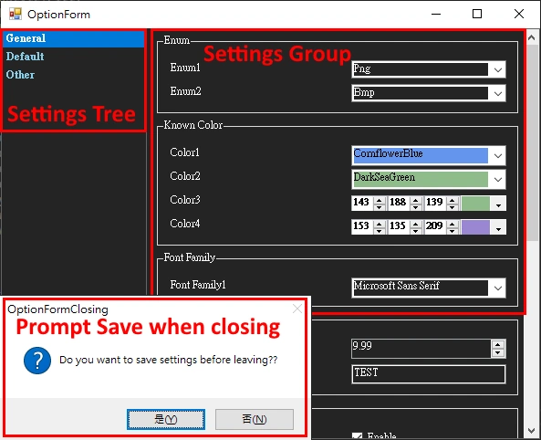
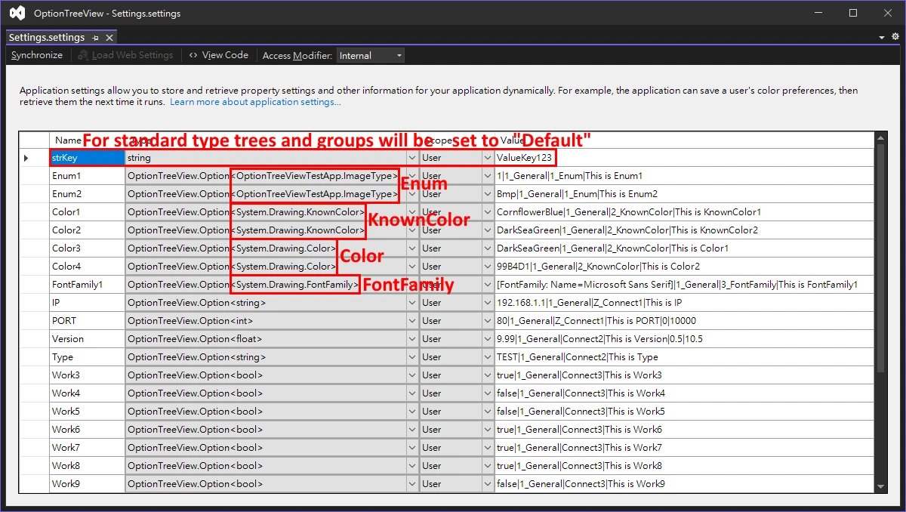
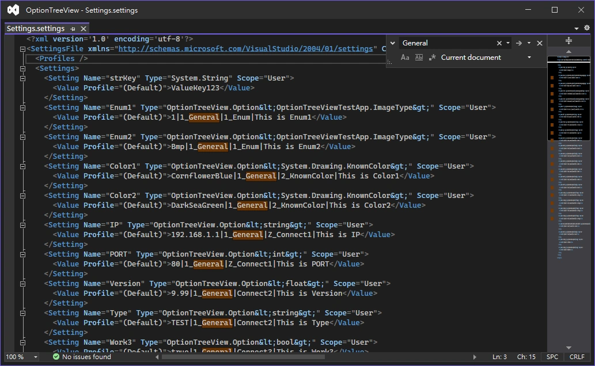

# Overview

OptionTreeView is a `UserControl` written in `.Net Framework 4.8`,  
that automatically generates options windows view. (using Settings.settings)  


## Table of Contents

- [Description](#description)
- [Getting Started](#getting-started)
  * [Add Reference](#add-reference)
  * [Drag component to Form](#drag-component-to-form)
  * [Settings.settings](#settingssettings)
  * [Generic(OptionTreeView.Option) in Settings](#genericoptiontreeviewoption-in-settings)
  * [Initialize OptionTreeView](#initialize-optiontreeview)
  * [Prompt Save](#prompt-save)
  * [Properties](#properties)
  * [Settings Usage and OptionTreeView.Option Class](#settings-usage-and-optiontreeviewoption-class)
- [Reference](#reference)

[TOC generated by markdown-toc](https://ecotrust-canada.github.io/markdown-toc/)


## Description

- OptionTreeView will `read and parse` the settings in `Settings.settings`.
- According to the parsing result, the settings are `assigned to different trees and groups`.
- For `standard type` settings, trees and groups will be set to `"Default"`.
- After specifying the Type of settings to `"OptionTreeView.Option" generic class`, the settings can be categorized into the `specified trees and groups`.




## Getting Started

### Add Reference 

- Add `"OptionTreeView.dll"` to the reference from your project.


### Drag component to Form

- Drag the Toolbox's `OptionTreeView` component to the Form of your project from Design Mode.


### Settings.settings

- Starting with the .NET Framework 2.0, you can create and access values that are persisted between application execution sessions.
- These values are called settings, [Using Application Settings and User Settings](https://docs.microsoft.com/en-us/dotnet/desktop/winforms/advanced/using-application-settings-and-user-settings?view=netframeworkdesktop-4.8)
- Create the Settings.settings file for the first time, from Solution > Project > Properties > Settings > Click here to create one.




### Generic(OptionTreeView.Option) in Settings

- To make the settings have tree and group classification, the type must be changed to `OptionTreeView.Option` generic class.
- Generic supported types are `sbyte, short, int, long, byte, ushort, uint, ulong, decimal, float, double, Enum, bool, string` and
- `System.Drawing.KnownColor` for Color Picker ComboBox.
- `System.Drawing.FontFamily` for Font Selector ComboBox.
- The Settings in the GUI Designer interface cannot set the type to a generic class, but...
- You can open Settings.settings with `XML(text) Editor`, and insert the generic class inside <Settings>, Refer to [Generic types for Settings.settings](https://stackoverflow.com/a/4046036)
- The format of the `OptionTreeView.Option` generic class in the setting value is: "value`|`TreeName`|`GroupName`|`Description`|`MinValue`|`MaxValue", use Vertical bar(`|`) to separate text, such as 
`"100|general|factor|This is Description"`  
`"100|general|factor|This is Description|-100|200"`  
- MinValue and MaxValue define the range of Value, which can be omitted.



- Example of Properties\Settings.settings

```xml
<SettingsFile ...>
  <Settings>
    <Setting Name="strKey" Type="System.String" Scope="User">
      <Value Profile="(Default)">ValueKey123</Value>
    </Setting>
    <Setting Name="Enum1" Type="OptionTreeView.Option&lt;OptionTreeViewTestApp.ImageType&gt;" Scope="User">
      <Value Profile="(Default)">1|1_General|1_Enum|This is Enum1</Value>
    </Setting>
    <Setting Name="Enum2" Type="OptionTreeView.Option&lt;OptionTreeViewTestApp.ImageType&gt;" Scope="User">
      <Value Profile="(Default)">Bmp|1_General|1_Enum|This is Enum2</Value>
    </Setting>
    <Setting Name="Color1" Type="OptionTreeView.Option&lt;System.Drawing.KnownColor&gt;" Scope="User">
      <Value Profile="(Default)">CornflowerBlue|1_General|2_KnownColor|This is Color1</Value>
    </Setting>
    <Setting Name="Color2" Type="OptionTreeView.Option&lt;System.Drawing.KnownColor&gt;" Scope="User">
      <Value Profile="(Default)">DarkSeaGreen|1_General|2_KnownColor|This is Color2</Value>
    </Setting>
    <Setting Name="FontFamily1" Type="OptionTreeView.Option&lt;System.Drawing.FontFamily&gt;" Scope="User">
      <Value Profile="(Default)">[FontFamily: Name=Microsoft Sans Serif]|1_General|3_FontFamily|This is FontFamily1</Value>
    </Setting>
    <Setting Name="IP" Type="OptionTreeView.Option&lt;string&gt;" Scope="User">
      <Value Profile="(Default)">192.168.1.1|1_General|Z_Connect1|This is IP</Value>
    </Setting>
    <Setting Name="PORT" Type="OptionTreeView.Option&lt;int&gt;" Scope="User">
      <Value Profile="(Default)">80|1_General|Z_Connect1|This is PORT|0|10000</Value>
    </Setting>
    <Setting Name="Version" Type="OptionTreeView.Option&lt;float&gt;" Scope="User">
      <Value Profile="(Default)">9.99|1_General|Connect2|This is Version|0.5|10.5</Value>
    </Setting>
    <Setting Name="Type" Type="OptionTreeView.Option&lt;string&gt;" Scope="User">
      <Value Profile="(Default)">TEST|1_General|Connect2|This is Type</Value>
    </Setting>
    <Setting Name="Work3" Type="OptionTreeView.Option&lt;bool&gt;" Scope="User">
      <Value Profile="(Default)">true|1_General|Connect3|This is Work3</Value>
    </Setting>
  </Settings>
</SettingsFile>
```


### Initialize OptionTreeView

- Perform `InitSettings` method, pass your project's "`Properties.Settings.Default`" settings to OptionTreeView.

```cs
//In the InitializeComponent section
private OptionTreeView.OptionTreeView optionTreeView1;
optionTreeView1 = new OptionTreeView.OptionTreeView();
...
//Pass your project's "Properties.Settings.Default" settings to OptionTreeView in your code.
optionTreeView1.InitSettings(Properties.Settings.Default);
```


### Prompt Save

- If the value is changed, it will ask if you want to save the setting when closing the window.


### Properties

- Appearance  
`ForeColorLeftView`: Gets or sets the foreground color of OptionLeftView.  
`BackColorLeftView`: Gets or sets the background color of OptionLeftView.  
`BorderStyleLeftView`: Gets or sets the border style of OptionLeftView.  
`FontLeftView`: Gets or sets the font of OptionLeftView.  
`ItemHeightLeftView`: Gets or sets the height of each tree node in the OptionLeftView.  

- Behavior  
`ContextMenuStripLeftView`: Gets or sets the ContextMenuStrip associated with this OptionLeftView.  
`FullRowSelectLeftView`: Gets or sets a value indicating whether the selection highlight spans the width of OptionLeftView.  
`ShowLeftView`: Gets or sets whether to show the left tree view.  
`ShowDefaultGroupName`: Gets or sets whether to display default names of unconfigured groups. Group default with 'Default' name when the group name is not specified in Settings.settings.  
`SortTreeBeforeUnderline`: Determine whether to sort by the values before the underline of tree name. Default is false.  
`SortGroupBeforeUnderline`: Determine whether to sort by the values before the underline of group name. Default is false.  
`FloatingPointDecimalPlaces`: Gets or sets the number of decimal places for floating-point numbers.  
`ShowToolTipDuration`: Gets or sets the number containing the duration, in milliseconds, to display the ToolTip.  
`InsertSpaceOnCamelCaseGroupName`: Get or set whether to automatically add spaces between CamelCases of GroupName. Default is true.  
`InsertSpaceOnCamelCaseLabelName`: Get or set whether to automatically add spaces between CamelCases of LabelName. Default is true.  
`InsertSpaceOnCamelCaseNumber`: Get or set whether to automatically add spaces between CamelCases and number. Default is false. Example: Abc123DefGhi => Abc 123 Def Ghi.  

- Layout
`OptionLeftCollapsed`: Gets or sets a value determining whether OptionLeft is collapsed or expanded.  
`OptionLeftMinSize`: Gets or sets the minimum distance in pixels of the OptionLeft.  
`OptionRightCollapsed`: Gets or sets a value determining whether OptionRight is collapsed or expanded.  
`OptionRightMinSize`: Gets or sets the minimum distance in pixels of the OptionRight.  
`OptionRightLabelSize`: Get or set the Label size in pixels of the OptionRight. Default 150.  
`SplitterDistance`: Gets or sets the location of the splitter, in pixels, from the left or top edge of the SplitContainer.  
`SplitterIncrement`: Gets or sets a value representing the increment of splitter movement in pixels.  
`SplitterWidth`: Gets or sets the width of the splitter in pixels.  


### Settings Usage and OptionTreeView.Option Class

- Get Value  
```cs
Properties.Settings.Default.VariableName.Value;
```

- Set Value  
```cs
Properties.Settings.Default.VariableName.Value = NewValue;
Properties.Settings.Default.Save();
```

- OptionTreeView.Option Class  
```cs
public class Option<dynamic> : BaseOption
{
  public dynamic Value
  {
    get => (dynamic)BaseObject;
    set
    {
      if (MinObject != null && MinObject.GetType().Name != "String" && value < MinObject) value = MinObject;
      if (MaxObject != null && MaxObject.GetType().Name != "String" && value > MaxObject) value = MaxObject;
      BaseObject = value;
    }
  }
  public Option(dynamic value, string treeName = "Default", string groupName = "Default", string description = "", object minObject = null, object maxObject = null) : base(value, treeName, groupName, description, minObject, maxObject) { }
  public override string ToString() => Value == null ? "" : Value.ToString();
}
    
public class BaseOption
{
    public dynamic BaseObject { get; set; }
    public string TreeName { get; private set; }
    public string GroupName { get; private set; }
    public string Description { get; private set; }
    public dynamic MinObject { get; private set; }
    public dynamic MaxObject { get; private set; }
    public BaseOption(dynamic baseObject, string treeName, string groupName, string description, dynamic minObject, dynamic maxObject)
    {
      BaseObject = baseObject;
      TreeName = treeName;
      GroupName = groupName;
      Description = description;
      MinObject = minObject;
      MaxObject = maxObject;
    }
}
```


## Reference

[Using Custom Classes with Application Settings](http://www.blackwasp.co.uk/CustomAppSettings.aspx)  
[Generic types for Settings.settings (it is possible to do this by manually editing the setting XML file.)](https://stackoverflow.com/a/4046036)  
[TypeConverter for a generic type／Creating an single Converter that could hanlde all of the types derrived](https://stackoverflow.com/a/14980794)  
[TypeConverter for a generic type／An alternative solution using TypeDescriptionProviderAttribute](https://stackoverflow.com/a/53771936)  
[Cast generic type without knowing T／With reflection and without the code knowing anything about 't', the closest you can get is an interface for MyType](https://www.reddit.com/r/csharp/comments/f2t0hw/comment/fherb76/?utm_source=share&utm_medium=web2x&context=3)  
[Cast generic type without knowing T／GetProperty and GetValue](https://social.msdn.microsoft.com/Forums/en-US/e1f9a9c0-ddb7-41b8-aad8-c2c4a8ef5e84/cast-generic-type-without-knowing-t?forum=aspcsharp)  
