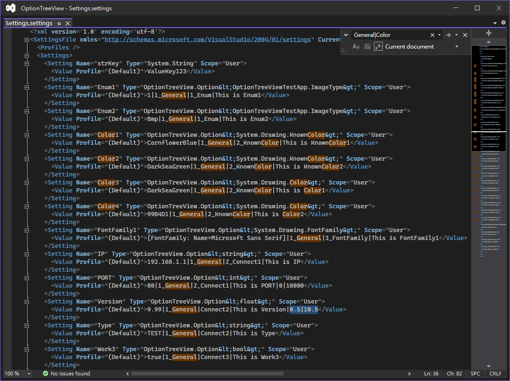

# Overview

OptionTreeView is a `UserControl` written in `.Net Framework 4.8`,  
that automatically generates options windows view. (using Settings.settings)  


## Table of Contents

- [Description](#description)
- [Getting Started](#getting-started)
  * [Add Reference](#add-reference)
  * [Drag component to Form](#drag-component-to-form)
  * [Settings.settings](#settingssettings)
  * [Generic(OptionTreeView.Option) in Settings](#genericoptiontreeviewoption-in-settings)
  * [Initialize OptionTreeView](#initialize-optiontreeview)
  * [Prompt Save](#prompt-save)
  * [Properties](#properties)
  * [Usage and OptionTreeView.Option Class](#usage-and-optiontreeviewoption-class)
- [Reference](#reference)

[TOC generated by markdown-toc](https://ecotrust-canada.github.io/markdown-toc/)


## Description

- OptionTreeView will `read and parse` the settings in `Settings.settings`.
- According to the parsing result, the settings are `assigned to different trees and groups`.
- For `standard type` settings, trees and groups will be set to `"Default"`.
- After specifying the Type of settings to `"OptionTreeView.Option" generic class`, the settings can be categorized into the `specified trees and groups`.


## Getting Started

### Add Reference 

- Add `"OptionTreeView.dll"` to the reference from your project.


### Drag component to Form

- Drag the Toolbox's `OptionTreeView` component to the Form of your project from Design Mode.


### Settings.settings

- Starting with the .NET Framework 2.0, you can create and access values that are persisted between application execution sessions.
- These values are called settings, [Using Application Settings and User Settings](https://docs.microsoft.com/en-us/dotnet/desktop/winforms/advanced/using-application-settings-and-user-settings?view=netframeworkdesktop-4.8)
- Create the Settings.settings file for the first time, from Solution > Project > Properties > Settings > Click here to create one.


### Generic(OptionTreeView.Option) in Settings

- To make the settings have tree and group classification, the type must be changed to `OptionTreeView.Option` generic class.
- Generic supported types are `sbyte, short, int, long, byte, ushort, uint, ulong, decimal, float, double, Enum, bool, string` and `System.Drawing.KnownColor` for Color Picker ComboBox.
- The Settings in the GUI Designer interface cannot set the type to a generic class, but...
- You can open Settings.settings with `XML(text) Editor`, and insert the generic class inside <Settings>, Refer to [Generic types for Settings.settings](https://stackoverflow.com/a/4046036)
- The format of the `OptionTreeView.Option` generic class in the setting value is: "value`|`TreeName`|`GroupName`|`Description", use Vertical bar(`|`) to separate text, such as `"100|general|factor|This is Description"`.



- Example of Properties\Settings.settings

```xml
<SettingsFile ...>
	<Settings>
		<Setting Name="strKey" Type="System.String" Scope="User">
			<Value Profile="(Default)">ValueKey123</Value>
		</Setting>
		<Setting Name="Enum1" Type="OptionTreeView.Option&lt;OptionTreeViewTestApp.ImageType&gt;" Scope="User">
			<Value Profile="(Default)">1|General|Enum|This is Enum1</Value>
		</Setting>
		<Setting Name="IP" Type="OptionTreeView.Option&lt;string&gt;" Scope="User">
			<Value Profile="(Default)">192.168.1.1|General|Connect1|This is IP</Value>
		</Setting>
		<Setting Name="PORT" Type="OptionTreeView.Option&lt;int&gt;" Scope="User">
			<Value Profile="(Default)">80|General|Connect1|This is PORT</Value>
		</Setting>
		<Setting Name="Version" Type="OptionTreeView.Option&lt;float&gt;" Scope="User">
			<Value Profile="(Default)">9.99|General|Connect2|This is Version</Value>
		</Setting>
		<Setting Name="Work3" Type="OptionTreeView.Option&lt;bool&gt;" Scope="User">
			<Value Profile="(Default)">true|General|Connect3|This is Work3</Value>
		</Setting>
	</Settings>
</SettingsFile>
```


### Initialize OptionTreeView

- Perform `InitSettings` method, pass your project's "`Properties.Settings.Default`" settings to OptionTreeView.

```cs
private OptionTreeView.OptionTreeView optionTreeView1;
optionTreeView1 = new OptionTreeView.OptionTreeView();
...
optionTreeView1.InitSettings(Properties.Settings.Default);
```


### Prompt Save

- If the value is changed, it will ask if you want to save the setting when closing the window.


### Properties

- Appearance

> `ForeColorLeftView`: Gets or sets the foreground color of OptionLeftView.  
> `BackColorLeftView`: Gets or sets the background color of OptionLeftView.  
> `BorderStyleLeftView`: Gets or sets the border style of OptionLeftView.  
> `FontLeftView`: Gets or sets the font of OptionLeftView.  
> `ItemHeightLeftView`: Gets or sets the height of each tree node in the OptionLeftView.  

- Behavior

> `ContextMenuStripLeftView`: Gets or sets the ContextMenuStrip associated with this OptionLeftView.  
> `FullRowSelectLeftView`: Gets or sets a value indicating whether the selection highlight spans the width of OptionLeftView.  
> `ShowLeftView`: Gets or sets whether to show the left tree view.  
> `ShowDefaultGroupName`: Gets or sets whether to display default names of unconfigured groups. Group default with 'Default' name when the group name is not specified in Settings.settings.  
> `SortTreeBeforeUnderline`: Determine whether to sort by the values before the underline of tree name. Default is false.  
> `SortGroupBeforeUnderline`: Determine whether to sort by the values before the underline of group name. Default is false.  
> `FloatingPointDecimalPlaces`: Gets or sets the number of decimal places for floating-point numbers.  


### Usage and OptionTreeView.Option Class

- Get Value

```cs
Properties.Settings.Default.VariableName.Value;
```

- Set Value

```cs
Properties.Settings.Default.VariableName.Value = NewValue;
Properties.Settings.Default.Save();
```

- OptionTreeView.Option Class

```cs
    public class Option<T> : BaseOption
    {
        public T Value { get; set; }
        public Option(T value) : this(value, "Default", "Default", "") { }
        public Option(T value, string treeName, string groupName, string description) : base(treeName, groupName, description) => Value = value;
        public override string ToString() => Value == null ? "" : Value.ToString();
    }
    
    public class BaseOption
    {
        public string TreeName { get; private set; }
        public string GroupName { get; private set; }
        public string Description { get; private set; }
        public BaseOption(string treeName, string groupName, string description)
        {
            TreeName = treeName;
            GroupName = groupName;
            Description = description;
        }
    }
```


## Reference

[Using Custom Classes with Application Settings](http://www.blackwasp.co.uk/CustomAppSettings.aspx)  
[Generic types for Settings.settings (it is possible to do this by manually editing the setting XML file.)](https://stackoverflow.com/a/4046036)  
[TypeConverter for a generic type／Creating an single Converter that could hanlde all of the types derrived](https://stackoverflow.com/a/14980794)  
[TypeConverter for a generic type／An alternative solution using TypeDescriptionProviderAttribute](https://stackoverflow.com/a/53771936)  
[Cast generic type without knowing T／With reflection and without the code knowing anything about 't', the closest you can get is an interface for MyType](https://www.reddit.com/r/csharp/comments/f2t0hw/comment/fherb76/?utm_source=share&utm_medium=web2x&context=3)  
[Cast generic type without knowing T／GetProperty and GetValue](https://social.msdn.microsoft.com/Forums/en-US/e1f9a9c0-ddb7-41b8-aad8-c2c4a8ef5e84/cast-generic-type-without-knowing-t?forum=aspcsharp)  
